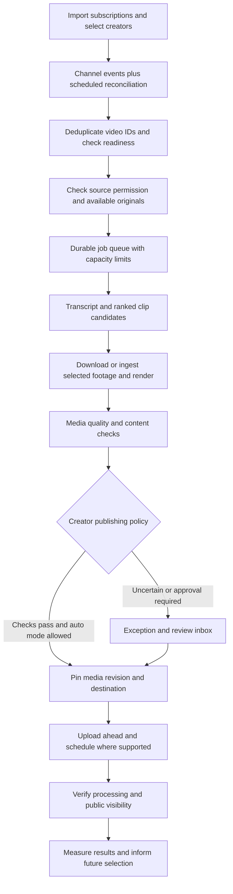

# Capy: creator automation audit

Date: 2026-10-09. Source revision: `2061efb`. Scope: architecture, creator discovery, clipping, review, scheduling, publishing, local operations, security boundaries, and recommendations for unattended operation.

**Assessment:** Capy is a substantial local video-production app with an assisted automation workflow. Preserve the existing clipping engine and editor. Before making publishing unattended, strengthen durable execution, approval/version checks, destination identity, and delivery recovery. Subscription import and reliable upload detection are the main missing acquisition features.

This audit did not connect accounts, start creator processing, or publish content. No application source was changed. Existing untracked `videos/` work was left alone.

## What is built

| Area | Implementation and current behavior |
|---|---|
| Desktop and web | Electron runs a Next.js 16.3.8 server; React 19 UI; TypeScript. A CLI shares pipeline functions. Electron supports a tray, wake-time posting checks, local settings and external tools. |
| Creator automation | Manually add a handle/channel/video. `server/watch.ts` stores channels and pending uploads; `server/watcher.ts` polls through yt-dlp and starts jobs. Default: hourly checks, two videos per creator and six overall per rolling 24 hours, three clips/video, minimum source length four minutes. UI permits shorter check intervals. |
| Video pipeline | Metadata → captions or local Whisper → AI picks → separate pick review → padded segment downloads → optional English translation → 1080×1920 render with captions/hook. Main modules: `src/pipeline.ts`, `src/youtube.ts`, `src/pick.ts`, `src/review.ts`, `src/render.ts`, `server/jobs.ts`. |
| Editorial controls | Pick selection, replacement, trim/speech snapping, transcript navigation, layout/look settings, thumbnail candidates, per-platform posting text, download and Finder reveal. |
| AI providers | `src/agents.ts` abstracts Claude plus additional installed CLI providers. README and setup doctor still emphasize Claude; provider readiness should follow the selected provider. |
| Posting | JSON-backed queue with human approval, audience-time-zone scheduling, missed-slot reconciliation, three retry delays, token refresh, platform progress checkpoints, and YouTube/Instagram/TikTok adapters. |
| Analytics and SEO | Connected YouTube channel snapshot, Analytics data where scopes allow, keyword research/cache, deterministic metadata score, and suggested metadata updates. Generic posting times and SEO scores are heuristics, not demonstrated reach predictions. |
| Stories | Separate original picture-book workflow: series/characters, plan, script, review, SVG art, narration, assembly, assessments, and queue integration. This adds product breadth but is not required for creator monitoring. |
| Persistence and security | Local JSON and media files; OAuth secrets have 0600 permissions; redacted browser responses; local Host/Origin guard; isolated Electron renderer. This is a single-owner local app, not an authenticated hosted service. |

## Evidence and limits

- All **369 tests in 41 files passed** (`node_modules/.bin/vitest run`).
- **TypeScript passed** (`node_modules/.bin/tsc --noEmit --incremental false`).
- A real synthetic source passed through `renderClip`: ffprobe confirmed **1080×1920 H.264, AAC, 1.000 second**. This checks the installed encoder/caption-render path, not editorial quality on real creator footage.
- An isolated Next dev instance on `127.0.0.1:3017` used fresh temporary data/output folders. Automation rendered in Chrome with no console errors/warnings. Home, Queue, Settings, Stories, Channel and To do returned HTTP 200 without the checked streamed-error markers. This is an empty-state browser/route smoke test, not a connected-account workflow test.
- Default local data folder `~/Library/Application Support/capy`: **accounts.json absent, zero watched creators, empty queue**. These observations do not rule out another configured data directory elsewhere.
- Existing job metadata: repository `output/` contained four ready jobs, 25 clips, 12 marked rendered; `~/Movies/capy` contained four ready jobs, 19 clips, four marked rendered. These are separate inventories, not unique-video totals or newly verified renders.
- No fresh production build, packaged Electron test, real creator download, AI inference, OAuth flow or public upload was performed. External publishing success and long-running reliability remain unverified.

## Findings to resolve before unattended publishing

**1. Approval protection is inconsistent — high priority, locally reproduced.**

The approval route checks an AI `block` verdict and requires explicit override (`app/api/queue/approve/route.ts`). The action route permits `post-now`/`retry` for a review or rejected entry without the same check (`app/api/queue/[key]/[action]/route.ts:10`). The PATCH route can also schedule an entry via `slotAt`. The poster does not enforce a central approval/policy rule immediately before upload.

Separately, `upsertForRender` retains a scheduled state when the same start/end cut is re-rendered, even if its updated review is `block` (`server/queue.ts:54`). Its fingerprint contains only start/end rounded to tenths; captions, hook, look, metadata, media bytes and destination identity are excluded.

In-memory fixture results: blocked review → `postNow` → `scheduled`; approved cut → same-cut re-render with blocked review → still `scheduled`. These were local function checks, not HTTP uploads.

Recommendation: one server-side publish-eligibility check shared by every transition and the uploader. Approve an immutable media/text revision and destination. Any relevant change invalidates the approval; review failures and uncertain results wait for intervention in unattended mode.

**2. Queue destinations are not pinned to an account — high priority, source-confirmed.**

`QueueEntry` contains `platform`, but no destination account/channel ID (`lib/types.ts:22`). The poster fetches the currently connected platform token at execution time. Reconnecting resumes blocked entries by platform (`server/connect.ts:90`, `server/queue.ts`), without comparing the old and new account identity. Connecting a different channel can therefore redirect queued uploads.

Recommendation: store immutable destination account/channel IDs, validate them before upload, and explicitly remap entries when changing accounts. Separate the YouTube account used to read subscriptions from the channel used to publish Shorts.

**3. External delivery has duplicate-risk windows — high priority, source-confirmed risk.**

YouTube's resumable-session URL is not saved; its video ID is checkpointed only after the upload response. TikTok saves its publish ID only after the transfer, and Instagram saves its published media ID after the publish response. A remote success followed by a lost response/crash can leave Capy unsure whether it succeeded. Recovery re-schedules interrupted posting entries.

Recommendation: persist sessions/IDs before transferring, resume uploads through provider protocols, reconcile uncertain outcomes before retrying, and retain an explicit `delivery_unknown` state. Use a local unique delivery key for source + clip revision + destination. Do not claim exactly-once external delivery from checkpoints alone. See Google's [resumable-upload protocol](https://developers.google.com/youtube/v3/guides/using_resumable_upload_protocol).

**4. JSON stores and process locks are insufficient for multiple workers — high priority, source-confirmed risk.**

Queue/watch mutations are synchronous within one process, but two processes can read the same old file and overwrite each other's changes. Atomic rename prevents partial files, not lost updates. `takePosterLock` reads then overwrites a lock; acquisition is not exclusive (`server/poster-lock.ts:22`). A long watcher scan can exceed the 90-second lease because its loop skips re-entry while running, so another process may take over. No fencing prevents a stale owner from continuing. Job saves use direct asynchronous `writeFile`, unlike the existing atomic helper (`server/jobs.ts:233`). Several loaders treat unreadable JSON as empty state.

Recommendation: a single worker owns execution, with SQLite transactions/WAL for the local version, unique constraints, durable leases, and heartbeat/fencing. Add versioned migrations, backups and corruption reporting. A shared hosted deployment should use a transactional server database, not a shared JSON folder.

**5. Restart recovery does not finish every interrupted video — high priority, source-confirmed.**

Jobs interrupted before usable picks/footage become errors; `resumeAutomation` does not rerun all missing stages (`server/jobs.ts:88,963`). Watched videos are marked seen when taken from pending, before success (`server/watch.ts:78`). Failures are not automatically requeued. The six-hour watchdog marks a job errored but does not cancel its underlying process (`server/watcher.ts:69`).

Recommendation: durable stage states, attempts, `retryAt`, heartbeats, checkpointed artifacts, bounded retries and an exception queue. Resume the first incomplete stage. Explicitly terminate a timed-out process tree before allowing replacement work.

**6. Monitoring can miss uploads and stall — high priority, source-confirmed.**

Only the latest 12 entries of `/videos` are fetched (`server/watcher.ts:37`). There is no pagination or published-time recovery cursor, so a long outage/high-volume creator can move unseen videos beyond the window. Shorts and stream archives have no explicit discovery path. Unknown duration/live items are deferred, but not enriched through a dedicated readiness check. Channel scans are serial; the general child-process helper has cancellation but no deadline, so a stuck listing can block all later channels (`src/exec.ts:102`).

Recommendation: official channel events plus paginated uploads reconciliation, durable video-ID deduplication, explicit live/premiere/Shorts filters, and delayed checks for source readiness. Apply per-channel timeouts, retry backoff and independent health status.

**7. “AI content review” does not review the finished audiovisual artifact — high priority for auto-posting.**

`server/jobs.ts:1008` sends transcript, translation and posting text to `src/content-review.ts`. It does not send video frames/audio. The story assessor similarly scores text, scene descriptions and metadata. It cannot detect a face cut out of frame, inaudible sound, black frames, visual private information or unreadable burned-in captions. An unavailable review becomes `caution`, intentionally suitable for the current human-review flow.

Recommendation: deterministic media checks (decode, duration, aspect, audio/silence, black frames, caption bounds) plus sampled-frame/audio assessment. Use a separate model/task for evaluation where useful, but calibrate with actual human decisions. AI scores are not proof of permissions or guaranteed platform acceptance.

**8. Generation outpaces publication — high priority for full automation.**

Default caps permit six source videos × three requested clips = up to **18 clips/day**, while `lib/post-time.ts` allocates **two posts/day/platform**, four hours apart. If all 18 clips are produced and approved for one destination, backlog grows by 16/day. The allocator searches only 14 days. This is capacity math, not observed traffic.

Recommendation: rank candidates before expensive downloads/renders, target a configurable number of queued publishing days, limit clips per creator, diversify topics, expire stale candidates and pause generation when publication capacity is full. Manual move/post-now paths also need consistent account-level limits.

**9. Runtime depends on the desktop/server remaining available — architectural gap.**

Watcher and poster timers live inside Next. Electron exits when its child server unexpectedly exits. There is no independent supervised worker, login/startup service, or worker-health alert. Sleep still stops local compute; wake-time reconciliation only helps afterward.

Recommendation: keep Electron as the control panel and move execution into a supervised worker. An always-awake Mac can run a launchd-managed worker; a laptop that sleeps requires an always-on remote worker for genuinely continuous processing. A webhook collector alone cannot render while the Mac is asleep. Use provider-side scheduled publishing where available.

**10. Resource and operations controls need expansion — medium priority.**

Platform HTTP calls have no explicit application deadline. There is no global disk/CPU/bandwidth/AI budget admission rule, automatic media-retention policy, proactive token-health check, or unified failure notification. `autoPost` currently means “add to review queue,” which is easy to confuse with autonomous publication. Default credentials are file-permission protected, not in macOS Keychain. `server/access.ts` always grants local-owner access; Host/Origin checks are not remote authentication.

Recommendation: explicit deadlines and cancellation, selective retries (daily quota waits until reset), a worker heartbeat, disk reserve checks, user-controlled cache retention, Keychain storage, and separate pause controls for monitoring, rendering and publishing. Never expose the current local API as a public webhook receiver.

## How to use your subscriptions and notifications

The app does not currently import subscriptions or consume your YouTube notification inbox. Browser cookies only help yt-dlp access YouTube; they do not connect your subscription list to Automation.

1. Add **Import my YouTube subscriptions** using OAuth `subscriptions.list(mine=true)`, with pagination and a creator-selection screen. The existing YouTube scope list already includes readonly access. Importing should not automatically enable every subscription; retain an explicit creator allowlist and backfill policy. [Official subscription API](https://developers.google.com/youtube/v3/docs/subscriptions/list).
2. Subscribe selected channel IDs to YouTube's PubSubHubbub/WebSub notifications through a small public callback service. Events include uploads and title/description edits, so deduplicate by video ID and distinguish metadata changes. Validate callback challenges/events, renew subscription leases, queue delivery durably, and let the worker pull authenticated tasks. [Official push-notification guide](https://developers.google.com/youtube/v3/guides/push_notifications).
3. Periodically reconcile each channel's uploads playlist through pagination to recover missed events and outages. Batch video metadata checks for duration, live status and availability. Avoid using keyword search as the upload detector.
4. Treat account bell/browser/email notifications as optional supporting signals. YouTube allows creators to suppress notifications and limits subscribers to three upload/live notifications per channel in 24 hours. They are not a complete event log. [YouTube notification behavior](https://support.google.com/youtube/answer/7457584?hl=en).

Start with subscription import plus polling if a public callback is unnecessary initially. Add push delivery when near-real-time detection matters. Neither approach automatically grants access to a downloadable source file.

## Platform feasibility and documentation corrections

- **YouTube:** add a capability check for the actual OAuth project/channel and verify the resulting processing/visibility state. Current official documentation is inconsistent: the videos page summary describes unaudited-upload restrictions, while its detailed privacy field says unverified uploads are not restricted. The app currently attributes every non-public result to an unaudited project and recommends changing it in Studio; that diagnosis is not established by the response. Report observed privacy and the actual platform reason. [Video status reference](https://developers.google.com/youtube/v3/docs/videos).
- **Scheduling:** upload ahead, verify processing, and use `status.publishAt` for eligible private, never-published YouTube videos. This lets YouTube execute the final scheduled transition even if the desktop later goes offline. [Scheduling fields](https://developers.google.com/youtube/v3/docs/videos#status.publishAt).
- **Quota:** README and `server/seo.ts` still describe uploads as 1,600 units. Google's June 2026 change moved uploads and search into separate buckets; current upload documentation describes one unit from a default 100-call/day upload bucket. Track real project limits rather than deriving upload capacity from the old combined model. [Revision history](https://developers.google.com/youtube/v3/revision_history), [upload reference](https://developers.google.com/youtube/v3/docs/videos/insert).
- **OAuth:** an external Google app left in Testing can receive refresh tokens that expire after seven days for these scopes. The setup guide mentions this correctly; unattended onboarding should verify readiness and show reconnect health. [Google OAuth lifecycle](https://developers.google.com/identity/protocols/oauth2).
- **TikTok:** the present default is inbox delivery and requires a person to finish posting. Direct Post guidelines reject private/internal upload utilities and copying arbitrary content from other platforms. They also require user-selected privacy/interaction controls; the current adapter automatically chooses privacy and enables interactions. An audit is not a guaranteed route to this intended automation. Keep TikTok out of the initial unattended commitment until there is an eligible integration and consent flow. [TikTok guidelines](https://developers.tiktok.com/docs/en/content-sharing-guidelines).
- **Instagram:** the current Facebook Login adapter expects a professional account linked to a Page. Verify the actual account, permissions, publishing limits and token lifecycle with a controlled integration test before promising unattended posting. [Meta's official API collection](https://www.postman.com/meta/instagram/documentation/6yqw8pt/instagram-api).
- **Source acquisition:** design for creator-owned/licensed originals delivered through a folder, object storage or an authorized source integration. A subscription or credit line is not a reuse authorization. YouTube's API policies restrict downloading/storing audiovisual content without prior written approval; yt-dlp integration should not be assumed acceptable for an audited API product. [Developer policies](https://developers.google.com/youtube/terms/developer-policies).
- **Monetization:** cropping/captioning alone does not establish eligibility. YouTube's reused-content assessment is distinct from copyright permission. Support original commentary/editorial transformation and track source permission explicitly. [Monetization policy](https://support.google.com/youtube/answer/1311392).

## Recommended target workflow

**Build order and acceptance criteria**

| Order | Deliverable | Evidence required |
|---|---|---|
| 1 | Durable execution and publish safeguards | Crash/restart at every stage; no lost jobs; no upload with stale approval; account switch cannot redirect a scheduled post; ambiguous upload outcome cannot trigger a blind duplicate. |
| 2 | Subscriptions and reliable discovery | Import more than one page of subscriptions; catch an upload after a long outage; repeated/edit events produce one job; premieres wait until ready; own destination channels cannot feed a re-clipping loop. |
| 3 | Media-aware review and per-creator auto mode | Manual, automatic clipping, and automatic publishing modes; allowed sources/topics/destinations; failed/unavailable checks stop auto-publication; exact media/text revision is recorded. |
| 4 | Always-on operation and monitoring | Worker starts after reboot, restarts after crash, reports heartbeat/lateness, respects disk/budget limits, and queues work while desktop UI is closed. Demonstrate at least a 72-hour soak with network/token/process faults. |
| 5 | Verified YouTube delivery | Controlled authorized upload with confirmed account, processing, visibility, scheduled release and local/remote ID mapping. Distinguish uploaded, processed, scheduled and public. |
| 6 | Quality and performance improvements | Speaker/face-aware crop; scene-aware fallback to blur; audio normalization; natural sentence boundaries; overlap/topic deduplication; analytics joined back to source and clip choices. |
| 7 | Additional platforms | Validate destination-specific eligibility, permissions, metadata/privacy UX, upload recovery and status reporting independently. |

The first release should focus on selected creators and one YouTube destination. Add a single dashboard that shows last successful discovery, current stage, exceptions, next publication, oldest pending item, disk reserve and account health. Store why each video was skipped and why each clip was selected. These controls provide more value for this goal than expanding Stories or adding more AI providers before unattended reliability is proven.
